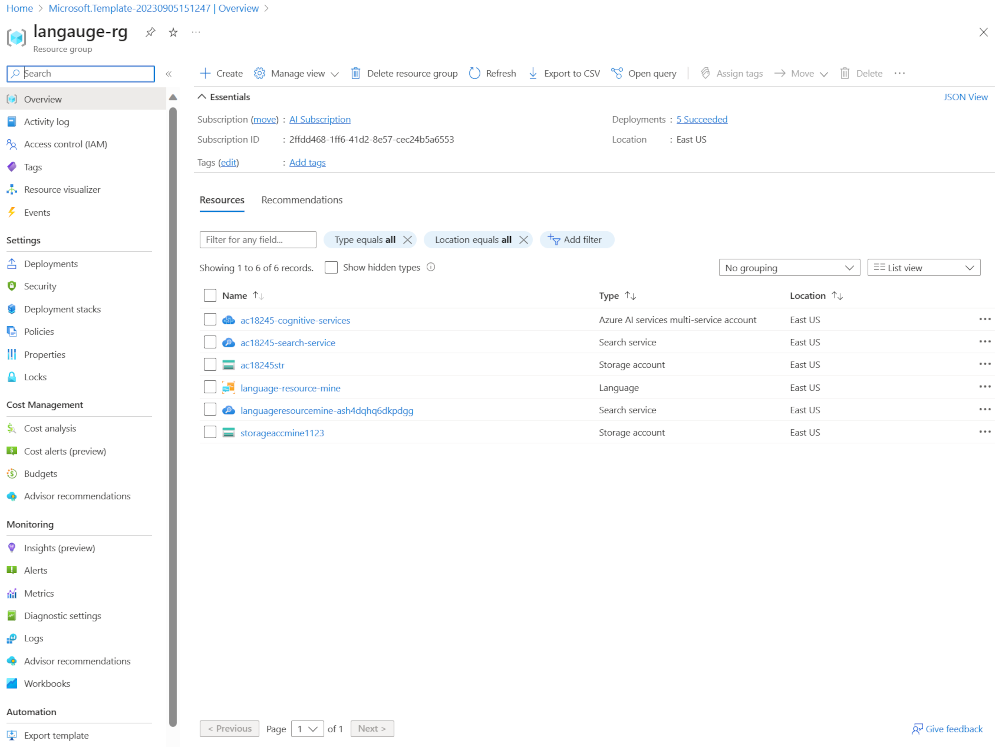
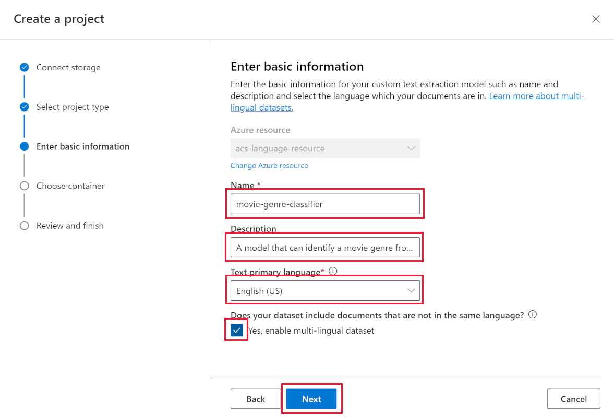
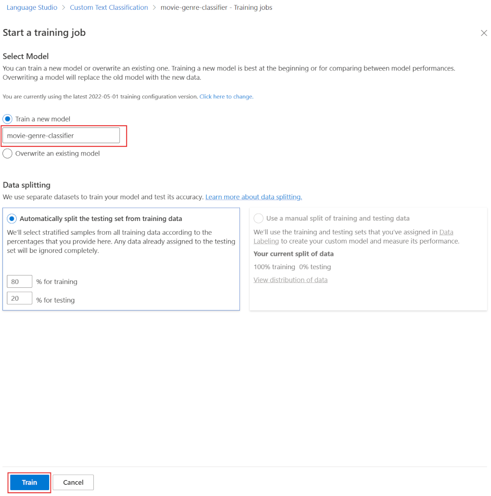
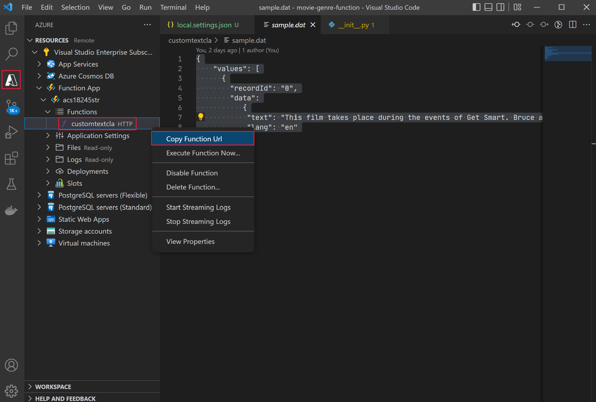

---
lab:
  title: Memperkaya indeks pencarian AI dengan kelas kustom
---

# Memperkaya indeks pencarian AI dengan kelas kustom

Anda telah membangun solusi pencarian dan sekarang ingin menambahkan Layanan Azure AI untuk pengayaan bahasa ke indeks Anda.

Dalam latihan ini, Anda akan membuat solusi Pencarian Azure AI dan memperkaya indeks dengan hasil dari proyek klasifikasi teks kustom Language Studio. Anda akan membuat aplikasi fungsi untuk menghubungkan pencarian dan model klasifikasi Anda bersama-sama.

> **Catatan** Untuk menyelesaikan latihan ini, Anda memerlukan langganan Microsoft Azure. Jika Anda belum memilikinya, Anda dapat mendaftar uji coba gratis di [https://azure.com/free](https://azure.com/free?azure-portal=true) .

## Siapkan lingkungan pengembangan Anda dengan Ekstensi Visual Studio Code, Python, dan Visual Studio Code

Instal alat ini untuk menyelesaikan latihan ini. Anda masih dapat mengikuti langkah-langkahnya tanpa alat ini.

1. Instal [Visual Studio Code](https://code.visualstudio.com/)
1. Instal [Alat Azure Core Functions](https://github.com/Azure/azure-functions-core-tools)
1. Instal [Ekstensi Alat Azure untuk Visual Studio Code](https://code.visualstudio.com/docs/azure/extensions)
1. Instal [Python 3.8](https://www.python.org/downloads/release/python-380/) untuk sistem operasi Anda.
1. Instal [Ekstensi Python untuk Visual Studio Code](https://marketplace.visualstudio.com/items?itemName=ms-python.python)

## Siapkan sumber daya Azure Anda

Untuk menghemat waktu Anda, pilih template Azure ARM ini untuk membuat sumber daya yang Anda perlukan nanti dalam latihan.

### Terapkan template ARM bawaan

1. [](https://portal.azure.com/#create/Microsoft.Template/uri/https%3A%2F%2Fraw.githubusercontent.com%2FMicrosoftLearning%2Fmslearn-knowledge-mining%2Fmain%2FLabfiles%2F04-enrich-custom-classes%2Fazuredeploy.json) pilih tautan ini untuk membuat sumber daya awal Anda. Anda mungkin perlu menyalin dan menempelkan [tautan langsung](https://portal.azure.com/#create/Microsoft.Template/uri/https%3A%2F%2Fraw.githubusercontent.com%2FMicrosoftLearning%2Fmslearn-knowledge-mining%2Fmain%2FLabfiles%2F04-enrich-custom-classes%2Fazuredeploy.json) ke bilah pencarian Anda.

    
1. Di **Grup sumber daya**, pilih ** Buat baru **, beri nama **cog-search-language-exe **.
1. Di **Wilayah**, pilih [wilayah yang didukung](https://learn.microsoft.com/azure/ai-services/language-service/concepts/regional-support) yang dekat dengan Anda.
1. **Awalan Sumber Daya** harus unik secara global, masukkan angka acak dan awalan karakter huruf kecil, misalnya **acs18245**.
1. Di **Lokasi**, pilih wilayah yang sama dengan yang Anda pilih di atas.
1. Pilih **Tinjau + buat**.
1. Pilih **Buat**.

    > **Catatan** Ada kesalahan yang ditampilkan, **Anda harus Menyetujui persyaratan layanan di bawah ini agar berhasil membuat sumber daya ini. **, dengan memilih **Buat** berarti Anda menyetujui persyaratan tersebut.

1. Pilih **Buka grup sumber daya** untuk melihat semua sumber daya yang telah Anda buat.

    
Anda akan menyiapkan indeks Azure Cognitive Search, membuat fungsi Azure, dan membuat proyek Studio Bahasa untuk mengidentifikasi genre film dari ringkasannya.

### Unggah data sampel untuk melatih layanan bahasa

Latihan ini menggunakan 210 file teks yang berisi ringkasan plot untuk sebuah film. Nama file teks adalah judul film. Folder tersebut juga berisi file **movieLabels.json** yang memetakan genre film ke file tersebut, untuk setiap file terdapat entri JSON seperti ini:

```json
{
    "location": "And_Justice_for_All.txt",
    "language": "en-us",
    "classifiers": [
        {
            "classifierName": "Mystery"
        },
        {
            "classifierName": "Drama"
        },
        {
            "classifierName": "Thriller"
        },
        {
            "classifierName": "Comedy"
        }
    ]
},
```

1. Navigasi ke **Labfiles/04-enrich-custom-classes** dan ekstrak folder **movies summary.zip** yang berisi semua file.

    > **Catatan** Anda menggunakan file ini untuk melatih model di Language Studio, dan juga akan mengindeks semua file di Pencarian Azure AI.

1. Di [portal Azure](https://portal.azure.com/), pilih **Grup sumber daya**, lalu pilih grup sumber daya Anda.
1. Pilih akun penyimpanan yang Anda buat, misalnya **acs18245str**.
1. Pilih **Konfigurasi** dari panel kiri, pilih opsi **Aktifkan** untuk pengaturan *Izinkan akses anonim Blob*, lalu pilih **Simpan** di bagian atas halaman.

    

1. Pilih **Kontainer** dari kiri, lalu pilih **+ Kontainer**.
1. Di panel **Kontainer baru**, masukkan **language-studio-training-data**, pada **Nama**.
1. Di **Tingkat akses anonim **, pilih **Kontainer (akses baca anonim untuk kontainer dan blob)** dan pilih **Buat**.
1. Pilih penampung baru yang baru saja Anda buat, **language-studio-training-data**.
    
1. Pilih **Unggah** di bagian atas panel.
1. Di panel **Unggah blob**, pilih **Telusuri file**.
1. Navigasikan ke tempat Anda mengekstrak file sampel, pilih semua file teks (`.txt`) dan json (`.json`).
1. Pilih **Unggah** di panel.
1. Tutup panel **Unggah blob**.

### Buat sumber daya bahasa

1. Pada tautan navigasi di bagian atas halaman, pilih **Beranda**.
1. Pilih **+ Buat sumber daya**, dan cari *Layanan bahasa*.
1. Pilih **Buat** di bagian **Layanan Bahasa**.
1. Pilih opsi yang menyertakan **Klasifikasi teks kustom dan Pengenalan entitas bernama kustom**.
1. Pilih **Lanjutkan untuk membuat sumber daya Anda**.
1. Di **Grup sumber daya**, pilih **cog-search-language-exe**.
1. Di **Wilayah**, pilih wilayah yang Anda gunakan di atas.
1. Di **Name**, masukkan **learn-language-service-for-custom-text**. Nama harus unik secara global, jadi Anda mungkin perlu menambahkan angka atau karakter acak di akhirnya.
1. Di tingkat **Harga**, pilih **S**.
1. Di **Akun penyimpanan baru/yang sudah ada**, pilih **Akun penyimpanan yang ada**.
1. Di **Akun penyimpanan di langganan dan wilayah sumber daya yang dipilih saat ini**, pilih akun penyimpanan yang Anda buat, misalnya **acs18245str**.
1. Setujui persyaratan **Pemberitahuan AI Bertanggung Jawab**, lalu pilih **Tinjau + buat**.
1. Pilih **Buat**.
1. Tunggu hingga sumber daya diterapkan, lalu pilih **Buka grup sumber daya**.
1. Pilih **learn-language-service-for-custom-text**.

    
1. Gulir ke bawah pada panel **Gambaran Umum**, dan pilih **Memulai dengan Language Studio**.
1. Masuk ke Language Studio. Jika diminta untuk memilih sumber daya Bahasa, pilih sumber daya yang Anda buat sebelumnya.

### Buat proyek klasifikasi teks khusus di Language Studio

1. Pada beranda Language Studio, pilih **Buat baru**, lalu pilih **Klasifikasi teks khusus**.

    

1. Pilih **Selanjutnya**.

    
1. Pilih **Klasifikasi multi label**, lalu pilih ** Berikutnya**.

    

1. Di **Nama**, masukkan **movie-genre-classifier**.
1. Dalam **Bahasa utama teks**, pilih **Bahasa Inggris (AS)**.
1. Di **Deskripsi**, masukkan **Model yang dapat mengidentifikasi genre film dari ringkasan**.
1. Pilih **Ya, aktifkan himpunan data multibahasa**.
1. Pilih **Selanjutnya**.

    

1. Di **Kontainer penyimpanan blob**, pilih **language-studio-training-data**.
1. Pilih **Ya, dokumen saya sudah diberi label dan saya memiliki file label JSON yang diformat dengan benar**.
1. Di **Label dokumen**, pilih **movieLabels**.
1. Pilih **Selanjutnya**.
1. Pilih **Buat proyek**.

### Melatih model AI klasifikasi teks kustom Anda

1. Di sebelah kiri, pilih **Pekerjaan pelatihan**.

    

1. Pilih **+ Mulai pekerjaan pelatihan**.

    
1. Di **Melatih modal baru**, masukkan **movie-genre-classifier**.
1. Pilih **Latih**.
1. Pelatihan model pengklasifikasi harus memakan waktu kurang dari 10 menit. Tunggu hingga status berubah menjadi **Pelatihan berhasil**.

### Sebarkan model AI klasifikasi teks kustom Anda

1. Di sebelah kiri, pilih **Menyebarkan model**.

    
1. Pilih **Tambahkan penyebaran**.

    
1. Di **Buat nama penyebaran baru**, masukkan **test-release**.
1. Di **Model**, pilih **movie-genre-classifier**.
1. Pilih **Sebarkan.**

Biarkan halaman web ini terbuka untuk nanti dalam latihan ini.

### Membuat indeks Pencarian Azure AI

Buat indeks pencarian yang dapat Anda perkaya dengan model ini, Anda akan mengindeks semua file teks yang berisi ringkasan film yang telah Anda unduh.

1. Di [portal Azure](https://portal.azure.com/), pilih **Grup sumber daya**, pilih grup sumber daya Anda, lalu pilih akun penyimpanan yang Anda buat, misalnya **acs18245str**.
1. Pilih **Kontainer** dari kiri, lalu pilih **+ Kontainer**.
1. Di panel **Penampung baru**, di bagian **Nama**, masukkan **search-data**.
1. Di **Tingkat akses anonim**, pilih **Kontainer**.
1. Pilih **Buat**.
1. Pilih penampung baru yang baru saja Anda buat, **search-data**.
1. Pilih **Unggah** di bagian atas panel.
1. Di panel **Unggah blob**, pilih **Telusuri file**.
1. Navigasikan ke tempat Anda mengunduh file sampel, pilih **HANYA** file teks (`.txt`).
1. Pilih **Unggah** di panel.
1. Tutup panel **Unggah blob**.

### Mengimpor dokumen ke Pencarian Azure AI

1. Di sebelah kiri, pilih **Grup sumber daya**, pilih grup sumber daya Anda, lalu pilih layanan pencarian Anda.

1. Pilih **Impor data**.

    
1. Di **Sumber Data**, pilih **Azure Blob Storage**.
1. Di **Nama sumber data**, masukkan **movie-summaries**.
1. Pilih **Pilih sambungan yang ada**, pilih akun penyimpanan, lalu pilih kontainer yang baru saja Anda buat, **search-data**.
1. Pilih **Tambahkan keterampilan kognitif (opsional)**.
1. Perluas bagian **Lampirkan Layanan AI**, lalu pilih layanan Azure AI yang Anda buat sebelumnya.

    
1. Luaskan bagian **Tambahkan pengayaan**.

    
1. Biarkan semua bidang dengan nilai defaultnya, lalu pilih **Ekstrak nama orang**.
1. Pilih **Ekstrak frasa kunci**.
1. Pilih **Deteksi bahasa**.
1. Pilih **Berikutnya: Sesuaikan indeks target**.

    
1. Biarkan semua bidang dengan nilai defaultnya, untuk **metadata_storage_name** pilih **Retrievable** dan **Searchable**.
1. Pilih **Berikutnya: Membuat pengindeks**.
1. Pilih **kirim**.

Pengindeks akan menjalankan dan membuat indeks dari 210 file teks. Anda tidak perlu menunggu untuk melanjutkan ke langkah selanjutnya.

## Buat aplikasi fungsi untuk memperkaya indeks pencarian Anda

Anda sekarang akan membuat aplikasi fungsi Python yang akan dipanggil oleh keahlian khusus pencarian kognitif Anda. Aplikasi fungsi akan menggunakan model pengklasifikasi teks khusus Anda untuk memperkaya indeks pencarian Anda.

1. [Unduh file yang diperlukan](https://github.com/MicrosoftLearning/mslearn-knowledge-mining/raw/main/Labfiles/04-enrich-custom-classes/movie-genre-function.zip) dan ekstrak folder yang berisi semua file.
1. Di Visual Studio Code, buka folder **movie-genre-function** yang baru saja Anda unduh.

    
1. Jika Anda telah menginstal semua ekstensi yang diperlukan, Anda akan diminta untuk mengoptimalkan proyek. Pilih **Ya**.
    
1. Pilih juru bahasa Python Anda, itu harus versi 3.8.
1. Ruang kerja akan diperbarui, jika Anda diminta untuk menghubungkannya ke folder ruang kerja, pilih **Ya**.
1. Tekan **F5** untuk men-debug aplikasi.

    
    Jika aplikasi sedang berjalan, Anda akan melihat URL localhost yang dapat Anda gunakan untuk pengujian lokal.

1. Berhenti menelusuri kesalahan aplikasi, tekan **SHIFT** + **F5**.

### Terapkan aplikasi fungsi lokal Anda ke Azure

1. Di Visual Studio Code, tekan **F1** untuk membuka palet perintah.
1. Di palet perintah, cari dan pilih `Azure Functions: Create Function App in Azure...`.
1. Masukkan nama unik global untuk aplikasi fungsi Anda, misalnya **acs13245str-function-app**.
1. Di ** Pilih tumpukan stack**, pilih **Python 3.8**.
1. Pilih lokasi yang sama yang Anda gunakan di atas.

1. Di navigasi kiri, pilih ekstensi **Azure**.
    
1. Perluas **Sumber daya**, perluas **Aplikasi Fungsi** di bagian langganan, lalu klik kanan pada fungsi tersebut, misalnya **acs13245-function-app**.
1. Pilih **Menyebarkan ke Aplikasi Fungsi**. Tunggu hingga aplikasi disebarkan.
1. Luaskan aplikasi, klik kanan pada **Pengaturan Aplikasi**, pilih **Unduh Pengaturan Jarak Jauh**.
1. Di sebelah kiri, pilih **Penjelajah**, lalu pilih **local.settings.json**.

    
Aplikasi fungsi harus terhubung ke model klasifikasi teks kustom Anda. Ikuti langkah-langkah ini untuk mendapatkan pengaturan konfigurasi.

1. Di peramban Anda, navigasikan ke **Language Studio**, Anda seharusnya berada di halaman **Menyebarkan model**.

    
1. Pilih model Anda. Lalu pilih **Dapatkan URL prediksi**.
1. Pilih ikon salin di sebelah **URL Prediksi**.
1. Di Visual Studio Code, di bagian bawah **local.settings.json**, tempel URL prediksi.
1. Di **Language Studio**, di sebelah kiri, pilih **Pengaturan proyek**.

    
1. Pilih ikon salin di sebelah **Kunci primer**.
1. Di Visual Studio Code, di bagian bawah **local.settings.json**, rekatkan kunci primer.
1. Edit pengaturan untuk menambahkan empat baris ini di bagian bawah, salin titik akhir ke dalam nilai `TA_ENDPOINT`.

    ```json
    ,
    "TA_ENDPOINT": " [your endpoint] ",
    "TA_KEY": " [your key] ",
    "DEPLOYMENT": "test-release",
    "PROJECT_NAME": "movie-genre-classifier"
    ```

1. Salin kunci primer ke dalam nilai `TA_KEY`.

    ```json
    {
      "IsEncrypted": false,
      "Values": {
        "AzureWebJobsStorage": "DefaultEndpointsProtocol=https;AccountName=...",
        "FUNCTIONS_EXTENSION_VERSION": "~4",
        "FUNCTIONS_WORKER_RUNTIME": "python",
        "WEBSITE_CONTENTAZUREFILECONNECTIONSTRING": "DefaultEndpointsProtocol=https;AccountName=...",
        "WEBSITE_CONTENTSHARE": "acs...",
        "APPINSIGHTS_INSTRUMENTATIONKEY": "6846...",
        "TA_ENDPOINT": "https://learn-languages-service-for-custom-text.cognitiveservices.azure.com/language/analyze-text/jobs?api-version=2022-05-01",
        "TA_KEY": "7105e938ce1...",
        "DEPLOYMENT": "test-release",
        "PROJECT_NAME": "movie-genre-classifier"
      }
    }

    ```

    Pengaturan akan terlihat seperti di atas, dengan nilai proyek Anda.
 
1. Tekan **CTRL**+**S** untuk menyimpan **perubahan local.settings.json** Anda.
1. Di navigasi kiri, pilih ekstensi **Azure**.
1. Perluas **Sumber Daya**, dan di bagian langganan Anda, perluas **Aplikasi Fungsi**, lalu klik kanan **Pengaturan Aplikasi**, pilih **Unggah Pengaturan Lokal**.

### Uji aplikasi fungsi jarak jauh Anda

Ada contoh kueri yang dapat Anda gunakan untuk menguji apakah aplikasi fungsi dan model pengklasifikasi berfungsi dengan benar.

1. Di sebelah kiri, pilih **Explorer**, perluas folder **customtextcla**, lalu pilih **sample.dat**.

    
1. Salin isi file.
1. Di sebelah kiri, pilih ekstensi **Azure**.

    
1. Di bawah **Aplikasi Fungsi**, perluas **Fungsi**, klik kanan pada **customtextcla**, lalu pilih **Jalankan Fungsi sekarang**.
1. Di **Masukkan isi permintaan**, tempelkan data sampel yang Anda salin, lalu tekan **Enter**.

    Aplikasi fungsi akan merespons dengan hasil JSON.

1. Perluas notifikasi untuk melihat seluruh hasil.

    
    Respons JSON akan terlihat seperti ini:

    ```json
    {"values": 
        [
            {"recordId": "0", 
            "data": {"text": 
            [
                {"category": "Action", "confidenceScore": 0.99}, 
                {"category": "Comedy", "confidenceScore": 0.96}
            ]}}
        ]
    }
    ```

### Tambahkan bidang ke indeks pencarian Anda

Anda memerlukan tempat untuk menyimpan pengayaan yang dikembalikan oleh aplikasi fungsi baru Anda. Ikuti langkah-langkah ini untuk menambahkan bidang gabungan baru untuk menyimpan klasifikasi teks dan skor kepercayaan.

1. Di [portal Azure](https://portal.azure.com/), buka grup sumber daya yang berisi layanan pencarian Anda, lalu pilih layanan pencarian kognitif yang Anda buat, misalnya **acs18245-search-service**.
1. Pada panel **Gambaran Umum**, pilih **Indeks**.
1. Pilih **indeks-azurebob**.
1. Pilih **Edit JSON**.
1. Tambahkan bidang baru ke indeks, tempel JSON di bawah bidang konten.

    ```json
    {
      "name": "textclass",
      "type": "Collection(Edm.ComplexType)",
      "analyzer": null,
      "synonymMaps": [],
      "fields": [
        {
          "name": "category",
          "type": "Edm.String",
          "facetable": true,
          "filterable": true,
          "key": false,
          "retrievable": true,
          "searchable": true,
          "sortable": false,
          "analyzer": "standard.lucene",
          "indexAnalyzer": null,
          "searchAnalyzer": null,
          "synonymMaps": [],
          "fields": []
        },
        {
          "name": "confidenceScore",
          "type": "Edm.Double",
          "facetable": true,
          "filterable": true,
          "retrievable": true,
          "sortable": false,
          "analyzer": null,
          "indexAnalyzer": null,
          "searchAnalyzer": null,
          "synonymMaps": [],
          "fields": []
        }
      ]
    },
    ```

    Indeks Anda sekarang akan terlihat seperti ini.

    
1. Pilih **Simpan**.

### Edit keahlian khusus untuk memanggil aplikasi fungsi Anda

Indeks pencarian kognitif membutuhkan cara agar bidang baru ini terisi. Edit keahlian yang Anda buat sebelumnya untuk memanggil aplikasi fungsi Anda.

1. Di bagian atas halaman, pilih tautan layanan pencarian, misalnya **acs18245-search-service | Indeks**.

1. Pada panel **Gambaran Umum**, pilih **Set Keterampilan**.

    
1. Pilih **azureblob-skillset**.
1. Tambahkan definisi keahlian khusus di bawah ini, dengan menempelkannya sebagai kumpulan keahlian pertama.

    ```json
    {
      "@odata.type": "#Microsoft.Skills.Custom.WebApiSkill",
      "name": "Genre Classification",
      "description": "Identify the genre of your movie from its summary",
      "context": "/document",
      "uri": "URI",
      "httpMethod": "POST",
      "timeout": "PT30S",
      "batchSize": 1,
      "degreeOfParallelism": 1,
      "inputs": [
        {
          "name": "lang",
          "source": "/document/language"
        },
        {
          "name": "text",
          "source": "/document/content"
        }
      ],
      "outputs": [
        {
          "name": "text",
          "targetName": "class"
        }
      ],
      "httpHeaders": {}
    },
    ```

Anda perlu mengubah `"uri": "URI"` untuk menunjuk ke aplikasi fungsi Anda.

1. Di Visual Studio Code, pilih ekstensi **Azure**.

    
1. Di bawah **Fungsi**, klik kanan **customtextcla**, lalu pilih **Salin Url Fungsi**.
1. Di portal Azure, ganti URI dengan URL fungsi yang disalin. 
1. Pilih **Simpan**.

### Edit pemetaan bidang di pengindeks

Anda sekarang memiliki bidang untuk menyimpan pengayaan, seperangkat keterampilan untuk memanggil aplikasi fungsi Anda, langkah terakhir adalah memberi tahu pencarian kognitif di mana harus meletakkan pengayaan.

1. Di bagian atas halaman, pilih layanan pencarian, misalnya, tautan **acs18245-search-service | Skillset**.

    
1. Pada panel **Gambaran Umum**, pilih **Pengindeks**.
1. Pilih **azureblob-indexer**.
1. Pilih **Definisi Pengindeks (JSON)**.
1. Tambahkan pemetaan bidang keluaran baru, dengan menempelkan definisi bidang ini ke bagian atas bidang keluaran.

    ```json
    {
      "sourceFieldName": "/document/class",
      "targetFieldName": "textclass"
    },
    ```

    Definisi JSON pengindeks sekarang akan terlihat seperti ini:

    
1. Pilih **Simpan**.
1. Pilih **Atur ulang**, lalu pilih **Ya**.
1. Pilih **Jalankan**, lalu pilih **Ya**.

    Layanan pencarian kognitif Azure Anda menjalankan pengindeks yang diperbarui. Pengindeks menggunakan keahlian khusus yang diedit. Skillet memanggil aplikasi fungsi Anda dengan dokumen yang diindeks. Model pengklasifikasi teks kustom menggunakan teks dalam dokumen untuk mencoba dan mengidentifikasi genre film. Model mengembalikan dokumen JSON dengan genre dan tingkat kepercayaan. Pengindeks memetakan hasil JSON ke bidang dalam indeks Anda menggunakan pemetaan bidang output baru.

1. Pilih **Riwayat eksekusi**.
1. Periksa apakah pengindeks telah berhasil dijalankan terhadap 210 dokumen.

    
    Anda mungkin perlu memilih **Refresh** untuk memperbarui status pengindeks.

## Uji indeks pencarian Anda yang diperkaya

1. Di bagian atas halaman, pilih layanan pencarian, misalnya **acs18245-search-service | Pengindeks**.

1. Pada panel **Gambaran Umum**, pilih **Indeks**.
1. Pilih **indeks-azurebob**.

    
1. Pilih **Telusuri**.
1. Jelajahi hasil pencarian.

Setiap dokumen dalam indeks harus memiliki bidang `textclass` baru yang dapat dicari. Ini berisi bidang kategori dengan genre film. Bisa lebih dari satu. Ini juga menunjukkan seberapa yakin model klasifikasi teks khusus tentang genre yang diidentifikasi.

Sekarang setelah Anda menyelesaikan latihan, hapus semua sumber daya yang tidak lagi Anda perlukan.

### Hapus sumber daya latihan

1. Di portal Microsoft Azure, pada halaman Beranda, pilih **Grup sumber daya**.
1. Pilih grup sumber daya yang tidak Anda perlukan, lalu pilih **Hapus grup sumber daya**.
