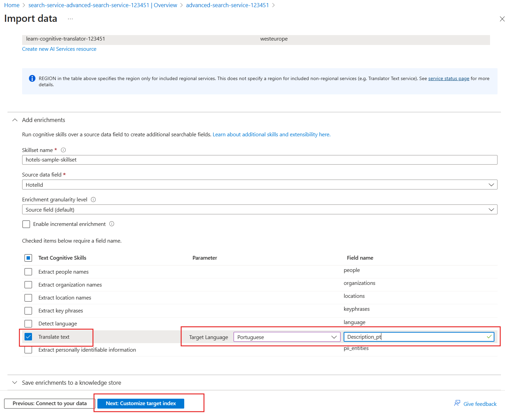

---
lab:
  title: Menerapkan penyempurnaan pada hasil pencarian
---

# Menerapkan penyempurnaan pada hasil pencarian

Anda memiliki layanan pencarian yang sudah ada yang digunakan aplikasi pemesanan liburan. Anda telah melihat bahwa relevansi hasil pencarian berdampak pada jumlah pemesanan yang Anda dapatkan. Anda juga baru-baru ini menambahkan hotel di Portugal sehingga ingin menawarkan bahasa Portugis sebagai bahasa yang didukung.

Dalam latihan ini, Anda akan menambahkan profil penilaian untuk meningkatkan relevansi hasil pencarian. Kemudian Anda akan menggunakan Layanan Azure AI untuk menambahkan deskripsi Portugis untuk semua hotel Anda.

> **Catatan** Untuk menyelesaikan latihan ini, Anda memerlukan langganan Microsoft Azure. Jika Anda belum memilikinya, Anda dapat mendaftar uji coba gratis di [https://azure.com/free](https://azure.com/free?azure-portal=true) .

## Membuat sumber daya Azure

Anda akan membuat Layanan Pencarian Azure AI dan mengimpor data hotel sampel.

1. Masuk ke [portal Azure](https://portal.azure.com/learn.docs.microsoft.com?azure-portal=true).
1. Pilih **+ Buat sumber daya**.
1. Cari **pencarian**, lalu pilih **Pencarian Azure AI**.
1. Pilih **Buat**.
1. Pilih **Buat baru** di bawah Grup sumber daya, beri nama **learn-advanced-search**.
1. Di **Nama layanan**, masukkan **advanced-search-service-12345**. Nama harus unik secara global sehingga tambahkan angka acak ke akhir nama.
1. Pilih Wilayah yang didukung di dekat Anda.
1. Gunakan nilai default untuk**tingkat harga **.
1. Pilih **Tinjau + buat**.
1. Pilih **Buat**.
1. Tunggu hingga sumber daya disebarkan, lalu pilih **Buka sumber daya**.

### Mengimpor data sampel ke layanan pencarian

Impor data sampel.

1. Pada panel **Ringkasan**, pilih **Impor data**.

    
1. Pada panel **Impor data**, di menu dropdown **Sumber data**, pilih **Sampel**.
1. Pilih **hotels-sample**.

1. Pada tab **Tambahkan keterampilan kognitif (Opsional)**, perluas **Lampirkan Layanan AI**, lalu pilih **Buat sumber daya Layanan AI baru**.

    

### Membuat Layanan Azure AI untuk mendukung terjemahan

1. Di tab baru, masuk ke portal Microsoft Azure.
1. Di **Grup sumber daya**, pilih**learn-advanced-search**.
1. Di **Wilayah**, pilih wilayah yang sama dengan yang Anda pilih untuk layanan pencarian.
1. Di **Nama**, masukkan **learn-cognitive-translator-12345** atau nama apa pun yang Anda inginkan. Nama harus unik secara global sehingga tambahkan angka acak ke akhir nama.
1. Di **Tingkat harga**, pilih **Standar S0**.
1. Centang **Dengan mencentang kotak ini saya mengakui bahwa saya telah membaca dan memahami semua ketentuan di bawah ini**.
1. Pilih **Tinjau + buat**.
1. Pilih **Buat**.
1. Ketika sumber daya telah dibuat, tutup tab.

### Tambahkan pengayaan terjemahan

1. Pada tab **Tambahkan keterampilan kognitif (Opsional)**, pilih Refresh.
1. Pilih layanan baru, **learn-cognitive-translator-12345**.
1. Luaskan bagian **Tambahkan pengayaan**.
    
1. Pilih **Terjemahkan teks**, ubah **Bahasa Target** menjadi **Bahasa Portugis**, lalu ubah **Nama bidang** menjadi **Description_pt**.
1. Pilih **Berikutnya: Sesuaikan indeks target**.

### Mengubah bidang untuk menyimpan teks yang diterjemahkan

1. Pada tab **Kustomisasi indeks target**, gulir ke bagian bawah daftar bidang dan ubah **Penganalisa** menjadi **Bahasa Portugis (Portugal) - Microsoft** untuk bidang **Description_pt**.
1. Pilih **Berikutnya: Membuat pengindeks**.
1. Pilih **kirim**.

    Indeks dibuat, pengindeks akan dijalankan, dan 50 dokumen yang berisi data hotel sampel akan diimpor.
1. Pada panel **Gambaran Umum**, pilih **Indeks**, lalu pilih **hotels-sample-index**.
1. Pilih **Cari** untuk melihat JSON untuk semua dokumen dalam indeks.
1. Cari **Description_pt** (Anda dapat menggunakan **CTRL + F** untuk ini) dalam hasil dan perhatikan bahwa itu bukan terjemahan Portugis dari deskripsi bahasa Inggris, tetapi terlihat seperti ini sebagai gantinya:

    ```json
    "Description_pt": "45",
    ```

Portal Microsoft Azure mengasumsikan bidang pertama dalam dokumen perlu diterjemahkan. Jadi saat ini menggunakan keterampilan terjemahan untuk menerjemahkan `HotelId`.

### Perbarui set keterampilan untuk menerjemahkan bidang yang benar dalam dokumen

1. Di bagian atas halaman, pilih layanan pencarian, tautan**advanced-search-service-12345 |Indeks**.
1. Pilih **Skillsets** di bawah Manajemen pencarian di panel kiri, lalu pilih **hotels-sample-skillset**.
1. Edit dokumen JSON, ubah baris 11 menjadi:

    ```json
    "context": "/document/Description",
    ```

1. Ubah default dari bahasa ke bahasa Inggris pada baris 12:

    ```json
    "defaultFromLanguageCode": "en",
    ```

1. Ubah bidang sumber pada baris 18 menjadi:

    ```json
    "source": "/document/Description"
    ```

1. Pilih **Simpan**.
1. Di bagian atas halaman, pilih layanan pencarian, **advanced-search-service-12345 | Skillsets** link.
1. Pada panel **Gambaran umum**, pilih **Indeks**, lalu pilih **hotels-sample-indexer**.
1. Pilih **Definisi Pengindeks (JSON)**.
1. Ubah nama bidang sumber pada baris 21 menjadi:

    ```json
    "sourceFieldName": "/document/Description/Description_pt",
    ```

1. Pilih **Simpan**.
1. Pilih **Reset**, lalu **Ya**.
1. Pilih **Jalankan** lalu pilih **Ya**.

### Menguji indeks yang diperbarui

1. Di bagian atas halaman, pilih layanan pencarian, tautan**advanced-search-service-12345 | Pengindeks**.
1. Pada panel **Gambaran Umum**, pilih **Indeks**, lalu pilih **hotels-sample-index**.
1. Pilih **Cari** untuk melihat JSON untuk semua dokumen dalam indeks.
1. Cari **Description_pt** dalam hasil dan perhatikan bahwa sekarang ada deskripsi Portugis.

    ```json
    "Description_pt": "O maior resort durante todo o ano da área oferecendo mais de tudo para suas férias – pelo melhor valor!  O que você pode desfrutar enquanto estiver no resort, além das praias de areia de 1,5 km do lago? Confira nossas atividades com certeza para excitar tanto os jovens quanto os jovens hóspedes do coração. Temos tudo, incluindo ser chamado de \"Propriedade do Ano\" e um \"Top Ten Resort\" pelas principais publicações.",
    ```

1. Sekarang Anda akan mencari hotel yang memiliki pemandangan danau. Kita akan mulai dengan menggunakan pencarian sederhana yang hanya mengembalikan `HotelName`, `Description`, `Category`, dan `Tags`. Dalam **String kueri**, masukkan pencarian ini:

    `lake + view&$select=HotelName,Description,Category,Tags&$count=true`

    Lihat hasilnya dan coba temukan bidang yang cocok dengan istilah pencarian `lake` dan `view`. Perhatikan hotel ini dan posisinya:

    ```json
    {
      "@search.score": 0.9433406,
      "HotelName": "Lady Of The Lake B & B",
      "Description": "Nature is Home on the beach.  Save up to 30 percent. Valid Now through the end of the year. Restrictions and blackout may apply.",
      "Category": "Luxury",
      "Tags": [
        "laundry service",
        "concierge",
        "view"
      ]
    },
    ```

Hotel ini telah cocok dengan istilah danau di bidang `HotelName` dan dilihat di bidang `Tags`. Anda ingin meningkatkan kecocokan istilah di bidang `Description` atas nama hotel. Idealnya, hotel ini harus terakhir dalam hasil.

## Tambahkan profil penilaian untuk meningkatkan hasil pencarian

1. Pilih tab **Profil penilaian**.
1. Pilih **+ Tambahkan profil penilaian**.
1. Di **Nama profil**, masukkan **kategori deskripsi-peningkatan**.
1. Tambahkan bidang dan bobot berikut di bawah **Bobot**:

    
1. Di **Nama bidang**, pilih **Deskripsi**.
1. Untuk **Bobot**, masukkan **5**.
1. Di **Nama bidang**, pilih **Kategori**.
1. Untuk **Bobot**, masukkan **3**.
1. Di **Nama bidang**, pilih **Tag**.
1. Untuk **Bobot**, masukkan **2**.
1. Pilih **Simpan**.
1. Pilih **Simpan** di bagian atas.

### Menguji indeks yang diperbarui

1. Kembali ke tab **Penjelajah pencarian** dari halaman**hotels-sample-index**.
1. Dalam **String kueri**, masukkan pencarian yang sama seperti sebelumnya:

    `lake + view&$select=HotelName,Description,Category,Tags&$count=true`

    Periksa hasil pencarian.

    ```json
    {
      "@search.score": 3.5707965,
      "HotelName": "Lady Of The Lake B & B",
      "Description": "Nature is Home on the beach.  Save up to 30 percent. Valid Now through the end of the year. Restrictions and blackout may apply.",
      "Category": "Luxury",
      "Tags": [
        "laundry service",
        "concierge",
        "view"
      ]
    }
    ```

    Skor pencarian telah meningkat, dari **0,9433406** menjadi **3,5707965**. Namun, semua hotel lain memiliki skor terhitung lebih tinggi. Hotel ini sekarang berada di urutan terakhir dalam hasil.

## Hapus sumber daya latihan

Sekarang setelah Anda menyelesaikan latihan, hapus semua sumber daya yang tidak lagi Anda perlukan.

1. Di portal Microsoft Azure, pilih **Grup Sumber Daya**.
1. Pilih grup sumber daya yang tidak Anda perlukan lagi, lalu pilih **Hapus grup sumber daya**.
