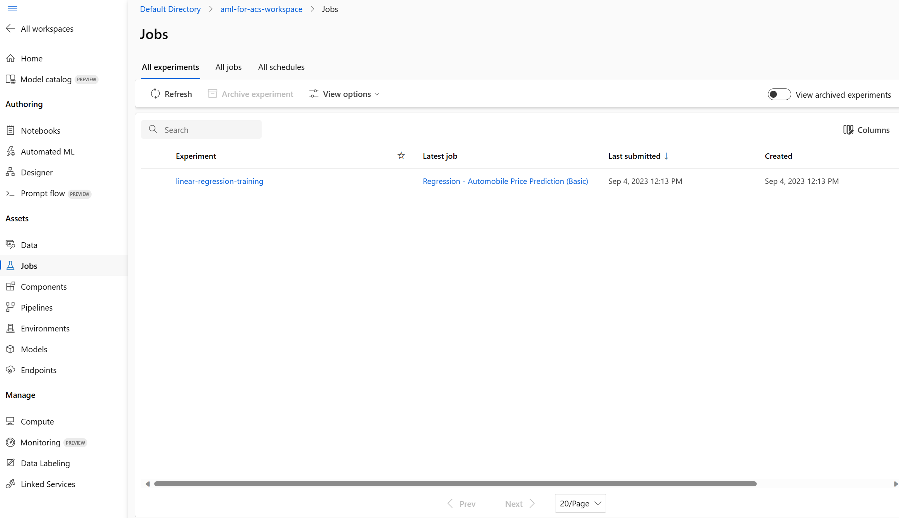

---
lab:
  title: Memperkaya indeks pencarian menggunakan model Azure Machine Learning
---

# Memperkaya indeks pencarian menggunakan model Azure Machine Learning

Anda dapat menggunakan kecanggihan pembelajaran mesin untuk memperkaya indeks pencarian. Untuk melakukannya, Anda akan menggunakan model yang dilatih di Azure AI Machine Learning Studio dan memanggilnya dari set keterampilan kustom pembelajaran mesin.

Dalam latihan ini, Anda akan membuat model Azure AI Machine Learning Studio, lalu melatih, menyebarkan, dan menguji titik akhir menggunakan model tersebut. Kemudian, Anda akan membuat layanan Azure Cognitive Search, membuat data sampel, dan memperkaya indeks menggunakan titik akhir Azure AI Machine Learning Studio.

> **Catatan** Untuk menyelesaikan latihan ini, Anda memerlukan langganan Microsoft Azure. Jika Anda belum memilikinya, Anda dapat mendaftar uji coba gratis di [https://azure.com/free](https://azure.com/free?azure-portal=true) .
>

## Membuat ruang kerja Pembelajaran Mesin Microsoft Azure

Sebelum Anda memperkaya indeks pencarian, buat ruang kerja Azure Machine Learning. Ruang kerja akan memberi Anda akses ke Azure AI Machine Learning Studio, yaitu alat grafis yang dapat Anda gunakan untuk membuat model AI dan menyebarkannya untuk digunakan.

1. Masuk ke [Portal Microsoft Azure](https://portal.azure.com).
1. Pilih **+ Buat sumber daya**.
1. Cari pembelajaran mesin, lalu pilih **Azure Machine Learning**.
1. Pilih **Buat**.
1. Pilih **Buat baru** pada **Grup sumber daya** dan beri hal tersebut nama **aml-for-acs-enrichment**.
1. Di bagian Detail Ruang Kerja, untuk **Nama**, masukkan **aml-for-acs-workspace**.
1. Pilih **Wilayah** yang didukung di dekat Anda.
1. Gunakan nilai bawaan untuk **Akun penyimpanan**, **Key Vault**, **Application Insights**, dan **Container Registry**.
1. Pilih **Tinjau + buat**.
1. Pilih **Buat**.
1. Tunggu hingga ruang kerja Azure Machine Learning disebarkan, lalu pilih **Buka sumber daya**.
1. Pada panel Gambaran Umum, pilih **Luncurkan studio**.

## Membuat alur pelatihan regresi

Anda kini akan membuat model regresi dan melatihnya menggunakan alur Azure AI Machine Learning Studio. Anda akan melatih model pada data harga mobil. Setelah dilatih, model akan memprediksi harga sebuah mobil berdasarkan atributnya.

1. Di beranda, pilih **Desainer**.

1. Dari daftar komponen bawaan, pilih **Regresi - Prediksi Harga Mobil (Dasar)**.

    

1. Pilih **Validasi**.

1. Pada panel **Validasi grafik**, pilih kesalahan **Pilih target komputasi di wizard pengiriman**.

    
1. Pada drop-down **Pilih tipe komputasi**, pilih **Instans komputasi**. Kemudian, pilih **Buat instans komputasi Azure ML** di bawahnya.
1. Di bidang **Nama komputasi**, masukkan nama unik (misalnya **compute-for-training**).
1. Pilih **Tinjau + buat**, lalu pilih **Buat**.

1. Di bidang **Pilih instans komputasi Azure ML**, pilih instans Anda dari drop-down. Anda mungkin perlu menunggu hingga provisi selesai.

1. Pilih **Validasi** lagi, alur akan terlihat sesuai harapan.

    
1. Pilih **Dasar** di panel **Siapkan pekerjaan alur**.
1. Pilih **Buat baru** pada nama Eksperimen.
1. Pada **Nama eksperimen baru**, masukkan **linear-regression-training**.
1. Pilih **Tinjau + Kirim** , lalu pilih **Kirim**.

### Membuat kluster inferensi untuk titik akhir

Saat alur melatih model regresi linier, Anda dapat membuat sumber daya yang diperlukan untuk titik akhir. Titik akhir ini memerlukan kluster Kubernetes untuk memproses permintaan web ke model Anda.

1. Di sebelah kiri, pilih **Compute**.

    
1. Pilih **kluster Kubernetes**, lalu pilih **+ Baru**.
1. Pada drop-down, pilih **AksCompute**.
1. Pada panel **Buat AksCompute**, pilih **Buat baru**.
1. Untuk **Lokasi**, pilih wilayah yang sama dengan yang Anda gunakan untuk membuat sumber daya lainnya.
1. Dalam daftar ukuran VM, pilih **Standard_A2_v2**.
1. Pilih **Selanjutnya**.
1. Pada **Nama komputasi**, masukkan **aml-acs-endpoint**.
1. Pilih **Aktifkan konfigurasi SSL**.
1. Di **Domain leaf**, masukkan **aml-for-acs**.
1. Pilih **Buat**.

### Mendaftarkan model terlatih Anda

Pekerjaan alur Anda seharusnya sudah selesai. Anda perlu mengunduh file `score.py` dan `conda_env.yaml`. Kemudian, Anda perlu mendaftarkan model terlatih.

1. Di sebelah kiri, pilih **Pekerjaan**.

    
1. Pilih eksperimen Anda, lalu pilih pekerjaan yang telah selesai dalam tabel, misalnya, **Regresi - Prediksi Harga Mobil (Dasar)**. Jika Anda diminta untuk menyimpan perubahan, pilih **Buang** untuk perubahan.
1. Di desainer, pilih **Gambaran umum pekerjaan** di kanan atas, lalu pilih node **Latih Model**.

    
1. Pada tab **Output + log**, luaskan folder **trained_model_outputs**.
1. Di samping `score.py`, pilih menu lainnya (**...**), lalu pilih **Unduh**.
1. Di samping `conda_env.yaml`, pilih menu lainnya (**...**), lalu pilih **Unduh**.
1. Pilih **+ Daftarkan model** di bagian atas tab.
1. Pada bidang **Output pekerjaan**, pilih folder **trained_model_outputs**. Kemudian, pilih **Berikutnya** di bagian bawah panel.
1. Untuk **Nama** model, masukkan **carevalmodel**.
1. Di **Deskripsi**, masukkan **Model regresi linier untuk memprediksi harga mobil.**.
1. Pilih **Selanjutnya**.
1. Pilih **Daftarkan**.

### Mengedit skrip penilaian untuk merespons Pencarian Azure AI dengan benar

Azure Machine Learning Studio telah mengunduh dua file ke lokasi unduhan default browser web Anda. Anda perlu mengedit file score.py untuk mengubah cara penanganan permintaan dan respons JSON. Anda dapat menggunakan editor teks atau editor kode seperti Visual Studio Code.

1. Di editor Anda, buka file score.py.
1. Ganti semua konten fungsi eksekusi:

    ```python
    def run(data):
    data = json.loads(data)
    input_entry = defaultdict(list)
    for row in data:
        for key, val in row.items():
            input_entry[key].append(decode_nan(val))

    data_frame_directory = create_dfd_from_dict(input_entry, schema_data)
    score_module = ScoreModelModule()
    result, = score_module.run(
        learner=model,
        test_data=DataTable.from_dfd(data_frame_directory),
        append_or_result_only=True)
    return json.dumps({"result": result.data_frame.values.tolist()})
    ```

    Dengan kode Python ini:

    ```python
    def run(data):
        data = json.loads(data)
        input_entry = defaultdict(list)
        
        for key, val in data.items():
                input_entry[key].append(decode_nan(val))
    
        data_frame_directory = create_dfd_from_dict(input_entry, schema_data)
        score_module = ScoreModelModule()
        result, = score_module.run(
            learner=model,
            test_data=DataTable.from_dfd(data_frame_directory),
            append_or_result_only=True)
        output = result.data_frame.values.tolist()
        
        return {
                "predicted_price": output[0][-1]
        }    
    ```

    Perubahan di atas memungkinkan mode menerima satu objek JSON dengan atribut mobil, bukan serangkaian mobil.

    Perubahan lainnya hanya mengembalikan prediksi harga mobil, bukan seluruh respons JSON.
1. Simpan perubahan di editor teks Anda.

## Membuat lingkungan kustom

Selanjutnya, Anda akan membuat lingkungan kustom sehingga Anda dapat menerapkannya ke titik akhir real time.

1. Pilih **Lingkungan** di panel navigasi.
1. Pilih tab **Lingkungan kustom**.
1. Pilih **+ Buat.**
1. Untuk **Nama**, masukkan **my-custom-environment**.
1. Dalam daftar *Lingkungan yang dikurasi* pada **Pilih jenis lingkungan**, pilih versi **automl-gpu** terbaru.
1. Pilih **Selanjutnya**.
1. Di komputer lokal Anda, buka file `conda_env.yaml` yang Anda unduh sebelumnya dan salin isinya.
1. Kembali ke browser, dan pilih **conda_dependencies.yaml** di panel Sesuaikan.
1. Di panel sebelah kanan, ganti isinya dengan kode yang Anda salin sebelumnya.
1. Pilih **Berikutnya**, lalu pilih **Berikutnya** lagi.
1. Pilih **Buat** untuk membuat lingkungan kustom Anda.

## Menyebarkan model dengan kode penilaian yang diperbarui <!--Option for web service deployment is greyed out. Can't go further after trying several different things.-->

Kluster inferensi Anda kini seharusnya siap digunakan. Anda juga telah mengedit kode penilaian untuk menangani permintaan dari set ketrampilan kustom Azure Cognitive Search Anda. Mari kita buat dan uji titik akhir untuk model.

1. Di sebelah kiri, pilih **Model**.
1. Pilih model yang Anda daftarkan, **carevalmodel**.

1. Pilih **Sebarkan**, lalu pilih **Titik akhir real time**.

    
1. Untuk **Nama**, masukkan nama unik, misalnya **car-evaluation-endpoint-1440637584** .
1. Untuk **Tipe komputasi**, pilih **Terkelola**.
1. Untuk **Tipe autentikasi**, pilih **Autentikasi berbasis kunci**.
1. Pilih **Berikutnya**, lalu pilih **Berikutnya**.
1. Pilih **Berikutnya** lagi.
1. Di bidang **Pilih skrip penilaian untuk inferensi**, jelajahi file `score.py` yang diperbarui dan pilih file tersebut.
1. Pada drop-down **Pilih tipe lingkungan**, pilih **Lingkungan kustom**.
1. Pilih kotak centang di lingkungan kustom Anda dari daftar.
1. Pilih **Selanjutnya**.
1. Untuk Mesin virtual, pilih **Standard_D2as_v4**.
1. Atur **Jumlah instans** ke **1**.
1. Pilih **Berikutnya**, lalu pilih **Berikutnya** lagi.
1. Pilih **Buat**.

Tunggu hingga model disebarkan, proses ini dapat memakan waktu hingga 10 menit. Anda dapat memeriksa statusnya di **Pemberitahuan** atau bagian titik akhir di Azure Machine Learning Studio.

### Menguji titik akhir model terlatih Anda

1. Di sebelah kiri, pilih **Titik akhir**.
1. Pilih **car-evaluation-endpoint**.
1. Pilih **Uji**, di **Masukkan data untuk menguji titik akhir** tempelkan contoh JSON ini.

    ```json
    {
        "symboling": 2,
        "make": "mitsubishi",
        "fuel-type": "gas",
        "aspiration": "std",
        "num-of-doors": "two",
        "body-style": "hatchback",
        "drive-wheels": "fwd",
        "engine-location": "front",
        "wheel-base": 93.7,
        "length": 157.3,
        "width": 64.4,
        "height": 50.8,
        "curb-weight": 1944,
        "engine-type": "ohc",
        "num-of-cylinders": "four",
        "engine-size": 92,
        "fuel-system": "2bbl",
        "bore": 2.97,
        "stroke": 3.23,
        "compression-ratio": 9.4,
        "horsepower": 68.0,
        "peak-rpm": 5500.0,
        "city-mpg": 31,
        "highway-mpg": 38,
        "price": 0.0
    }
    ```

1. Pilih **Uji**, dan Anda akan melihat respons:

    ```json
    {
        "predicted_price": 5852.823214312815
    }
    ```

1. Pilih **Gunakan**.

    
1. Salin **titik akhir REST**.
1. Salin **Kunci primer**.

### Mengintegrasikan model Azure Machine Learning dengan pencarian Azure AI

Selanjutnya, Anda membuat layanan Cognitive Search baru dan memperkaya indeks menggunakan set keterampilan kustom.

### Membuat file uji

1. Di portal Microsoft Azure, pilih [Grup sumber daya](https://portal.azure.com/learn.docs.microsoft.com?azure-portal=true).
1. Pilih **aml-for-acs-enrichment**.

    
1. Pilih akun penyimpanan, misalnya **amlforacsworks1440637584**.
1. Pilih **Konfigurasi** pada **Pengaturan**. Kemudian, atur **Izinkan akses anonim Blob** ke **Diaktifkan**.
1. Pilih **Simpan**.
1. Di bawah **Penyimpanan data**, pilih **Kontainer**. 
1. Buat kontainer baru untuk menyimpan data indeks, pilih **+ Kontainer**.
1. Di panel **Kontainer baru**, pada **Nama**, masukkan **docs-to-search**.
1. Pada **Tingkat akses anonim**, pilih **Kontainer (akses baca anonim untuk kontainer dan blob)**.
1. Pilih **Buat**.
1. Pilih kontainer **docs-to-search** yang Anda buat.
1. Di editor teks, buat dokumen JSON:

    ```json
    {
      "symboling": 0,
      "make": "toyota",
      "fueltype": "gas",
      "aspiration": "std",
      "numdoors": "four",
      "bodystyle": "wagon",
      "drivewheels": "fwd",
      "enginelocation": "front",
      "wheelbase": 95.7,
      "length": 169.7,
      "width": 63.6,
      "height": 59.1,
      "curbweight": 2280,
      "enginetype": "ohc",
      "numcylinders": "four",
      "enginesize": 92,
      "fuelsystem": "2bbl",
      "bore": 3.05,
      "stroke": 3.03,
      "compressionratio": 9.0,
      "horsepower": 62.0,
      "peakrpm": 4800.0,
      "citympg": 31,
      "highwaympg": 37,
      "price": 0
    }
    ```

    Simpan dokumen ke mesin Anda sebagai ekstensi `test-car.json`.
1. Di portal, pilih **Unggah**.
1. Di panel **Unggah blob**, pilih **Jelajahi file**, navigasikan ke tempat Anda menyimpan dokumen JSON, dan pilih dokumen tersebut.
1. Pilih **Unggah**.

### Membuat sumber daya  Pencarian Azure AI

1. Di portal Azure, pada beranda, pilih **+ Buat sumber daya**.
1. Cari **Pencarian Azure AI**, lalu pilih **Pencarian Azure AI**.
1. Pilih **Buat**.
1. Di **Grup Sumber Daya**, pilih **aml-for-acs-enrichment**.
1. Pada Nama layanan, masukkan nama unik, misalnya **acs-enriched-1440637584**.
1. Untuk **Lokasi**, pilih wilayah yang sama dengan yang Anda gunakan sebelumnya.
1. Pilih **Tinjau + buat**, lalu pilih **Buat**.
1. Tunggu hingga sumber daya disebarkan, lalu pilih **Buka sumber daya**.
1. Pilih **Impor data**.
1. Pada panel **Sambungkan ke data Anda**, untuk bidang **Sumber data**, pilih **Azure Blob Storage**.
1. Pada **Nama sumber data**, masukkan **import-docs**.
1. Pada **Mode penguraian**, pilih **JSON**.
1. Pada **String koneksi**, pilih **Pilih koneksi yang ada**.
1. Pilih akun penyimpanan tempat Anda melakukan pengunggahan, misalnya, **amlforacsworks1440637584**.
1. Di panel **Kontainer**, pilih **docs-to-search**. 
1. Pilih **Pilih**.
1. Pilih **Berikutnya: Tambahkan keterampilan kognitif (Opsional)**.

### Menambahkan keterampilan kognitif

1. Luaskan **Tambahkan pengayaan**, lalu pilih **Ekstrak nama orang**.
1. Pilih **Berikutnya: Sesuaikan indeks target**.
1. Pilih **+ Tambahkan bidang**, pada **Nama bidang** masukkan **predicted_price** di bagian bawah daftar.
1. Pada **Tipe**, pilih **Edm.Double** untuk entri baru Anda.
1. Pilih **Dapat diambil** untuk semua bidang.
1. Pilih **Dapat Ditelusuri** untuk **buat**.
1. Pilih **Berikutnya: Membuat pengindeks**.
1. Pilih **kirim**.

## Menambahkan Keterampilan AML ke keahlian

Anda kini perlu mengganti pengayaan nama orang dengan set keterampilan kustom Azure Machine Learning.

1. Pada panel Gambaran umum, pilih **Set ketrampilan** di bawah **Manajemen pencarian**.
1. Pada **Nama**, pilih **azureblob-skillset**.
1. Ganti definisi keterampilan untuk `EntityRecognitionSkill` dengan JSON ini, ingatlah untuk mengganti nilai titik akhir dan kunci primer yang Anda salin:

    ```json
    "@odata.type": "#Microsoft.Skills.Custom.AmlSkill",
    "name": "AMLenricher",
    "description": "AML studio enrichment example",
    "context": "/document",
    "uri": "PASTE YOUR AML ENDPOINT HERE",
    "key": "PASTE YOUR PRIMARY KEY HERE",
    "resourceId": null,
    "region": null,
    "timeout": "PT30S",
    "degreeOfParallelism": 1,
    "inputs": [
      {
        "name": "symboling",
        "source": "/document/symboling"
      },
      {
        "name": "make",
        "source": "/document/make"
      },
      {
        "name": "fuel-type",
        "source": "/document/fueltype"
      },
      {
        "name": "aspiration",
        "source": "/document/aspiration"
      },
      {
        "name": "num-of-doors",
        "source": "/document/numdoors"
      },
      {
        "name": "body-style",
        "source": "/document/bodystyle"
      },
      {
        "name": "drive-wheels",
        "source": "/document/drivewheels"
      },
      {
        "name": "engine-location",
        "source": "/document/enginelocation"
      },
      {
        "name": "wheel-base",
        "source": "/document/wheelbase"
      },
      {
        "name": "length",
        "source": "/document/length"
      },
      {
        "name": "width",
        "source": "/document/width"
      },
      {
        "name": "height",
        "source": "/document/height"
      },
      {
        "name": "curb-weight",
        "source": "/document/curbweight"
      },
      {
        "name": "engine-type",
        "source": "/document/enginetype"
      },
      {
        "name": "num-of-cylinders",
        "source": "/document/numcylinders"
      },
      {
        "name": "engine-size",
        "source": "/document/enginesize"
      },
      {
        "name": "fuel-system",
        "source": "/document/fuelsystem"
      },
      {
        "name": "bore",
        "source": "/document/bore"
      },
      {
        "name": "stroke",
        "source": "/document/stroke"
      },
      {
        "name": "compression-ratio",
        "source": "/document/compressionratio"
      },
      {
        "name": "horsepower",
        "source": "/document/horsepower"
      },
      {
        "name": "peak-rpm",
        "source": "/document/peakrpm"
      },
      {
        "name": "city-mpg",
        "source": "/document/citympg"
      },
      {
        "name": "highway-mpg",
        "source": "/document/highwaympg"
      },
      {
        "name": "price",
        "source": "/document/price"
      }
    ],
    "outputs": [
      {
        "name": "predicted_price",
        "targetName": "predicted_price"
      }
    ]  
    ```

1. Pilih **Simpan**.

### Memperbarui pemetaan bidang output

1. Kembali ke panel **Gambaran umum**, dan pilih **pengindeks**, lalu pilih **azureblob-indexer**.
1. Pilih tab **Definisi Pengindeks (JSON)**, lalu ubah nilai **outputFieldMappings** menjadi:

    ```json
    "outputFieldMappings": [
        {
          "sourceFieldName": "/document/predicted_price",
          "targetFieldName": "predicted_price"
        }
      ]
    ```

1. Pilih **Simpan**.
1. Pilih **Atur ulang**, lalu pilih **Ya**.
1. Pilih **Jalankan**, lalu pilih **Ya**.

## Menguji pengayaan indeks

Set ketrampilan yang diperbarui kini akan menambahkan nilai prediksi ke dokumen mobil pengujian di indeks Anda. Untuk menguji hal ini, ikuti langkah-langkah ini.

1. Pada panel **Gambaran umum** layanan pencarian Anda, pilih **Penjelajah pencarian** di bagian atas panel.
1. Pilih **Telusuri**.
1. Gulir ke bagian bawah hasil.
    
Anda akan melihat kolom `predicted_price` yang sudah terisi.

## Hapus sumber daya latihan

Sekarang setelah Anda menyelesaikan latihan, hapus semua sumber daya yang tidak lagi Anda perlukan. Menghapus sumber daya Azure:

1. Di portal Microsoft Azure, pilih **Grup sumber daya**.
1. Pilih grup sumber daya yang tidak Anda perlukan lagi, lalu pilih **Hapus grup sumber daya**.
