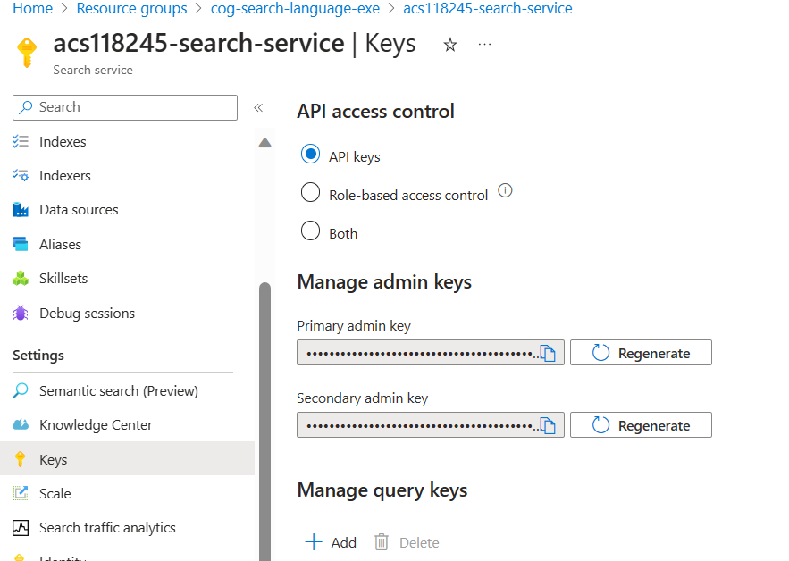
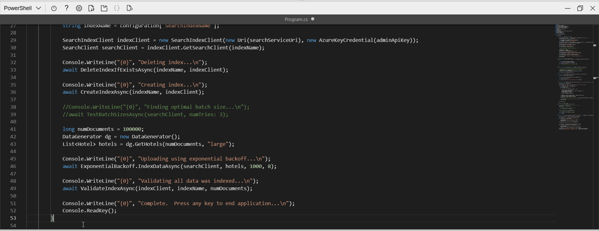

---
lab:
  title: Menambahkan ke indeks menggunakan API pendorongan
---

# Menambahkan ke indeks menggunakan API pendorongan

Anda ingin menjelajahi cara membuat indeks Pencarian Azure AI dan mengunggah dokumen ke indeks tersebut menggunakan kode C#.

Dalam latihan ini, Anda akan mengkloning solusi C# yang ada dan menjalankannya untuk menghasilkan ukuran batch yang optimal untuk mengunggah dokumen. Anda kemudian akan menggunakan ukuran batch ini dan mengunggah dokumen secara efektif menggunakan pendekatan berutas.

> **Catatan** Untuk menyelesaikan latihan ini, Anda memerlukan langganan Microsoft Azure. Jika Anda belum memilikinya, Anda dapat mendaftar uji coba gratis di [https://azure.com/free](https://azure.com/free?azure-portal=true) .

## Siapkan sumber daya Azure Anda

Untuk menghemat waktu Anda, pilih templat Azure Resource Manager ini untuk membuat sumber daya yang Anda perlukan nanti dalam latihan:

1. [Sebarkan sumber daya ke Azure](https://portal.azure.com/#create/Microsoft.Template/uri/https%3A%2F%2Fraw.githubusercontent.com%2FMicrosoftLearning%2Fmslearn-knowledge-mining%2Fmain%2FLabfiles%2F07-exercise-add-to-index-use-push-api%20lab-files%2Fazuredeploy.json) - pilih tautan ini untuk membuat sumber daya Azure AI Anda.
    
1. Di **Grup sumber daya**, pilih ** Buat baru **, beri nama **cog-search-language-exe **.
1. Di **Wilayah**, pilih [wilayah yang didukung](/azure/ai-services/language-service/custom-text-classification/service-limits#regional-availability) yang dekat dengan Anda.
1. **Awalan Sumber Daya** harus unik secara global, masukkan angka acak dan awalan karakter huruf kecil, misalnya, **acs118245**.
1. Di **Lokasi**, pilih wilayah yang sama dengan yang Anda pilih di atas.
1. Pilih **Tinjau + buat**.
1. Pilih **Buat**.
1. Setelah penyebaran selesai, pilih **Buka grup sumber daya** untuk melihat semua sumber daya yang telah Anda buat.

    

## Menyalin informasi REST API layanan Pencarian Azure AI

1. Dalam daftar sumber daya, pilih layanan pencarian yang Anda buat. Pada contoh di atas, **acs118245-search-service**.
1. Salin nama layanan pencarian ke dalam file teks.

    
1. Di sebelah kiri, pilih **Kunci**, lalu salin **Kunci admin utama** ke dalam file teks yang sama.

## Kloning repositori ke Cloud Shell Anda.

Anda akan mengembangkan kode menggunakan Cloud Shell dari portal Azure. File kode untuk aplikasi Anda telah disediakan dalam repositori GitHub.

> **Tips**: Jika Anda telah mengkloning repo **mslearn-knowledge-mining** baru-baru ini, Anda dapat melewati tugas ini. Jika belum melakukannya, ikuti langkah-langkah berikut untuk mengkloningnya ke lingkungan pengembangan Anda.

1. Gunakan tombol **[\>_]** di sebelah kanan bilah pencarian di bagian atas halaman untuk membuat Cloud Shell baru di portal Azure, dengan memilih lingkungan ***PowerShell***. Cloud shell menyediakan antarmuka baris perintah dalam panel di bagian bawah portal Azure.

    > **Catatan**: Jika sebelumnya Anda telah membuat cloud shell yang menggunakan lingkungan *Bash* , alihkan ke ***PowerShell***.

1. Di toolbar cloud shell, di menu **Pengaturan**, pilih **Buka versi Klasik** (ini diperlukan untuk menggunakan editor kode).

    > **Tips**: Saat Anda menempelkan perintah ke cloudshell, ouput mungkin mengambil sejumlah besar buffer layar. Anda dapat menghapus layar dengan memasukkan `cls` perintah untuk mempermudah fokus pada setiap tugas.

1. Di panel PowerShell, masukkan perintah berikut untuk mengkloning repositori GitHub untuk latihan ini:

    ```
    rm -r mslearn-knowledge-mining -f
    git clone https://github.com/microsoftlearning/mslearn-knowledge-mining mslearn-knowledge-mining
    ```

1. Setelah repositori dikloning, navigasikan ke folder yang berisi file kode aplikasi:  

    ```
   cd mslearn-knowledge-mining/Labfiles/07-exercise-add-to-index-use-push-api/OptimizeDataIndexing
    ```

## Menyiapkan aplikasi Anda

1.  Dengan menggunakan `ls` perintah , Anda dapat melihat konten folder **OptimizeDataIndexing**. Perhatikan bahwa ini berisi `appsettings.json` file untuk pengaturan konfigurasi.

1. Masukkan perintah berikut untuk mengedit file konfigurasi yang telah disediakan:

    ```
   code appsettings.json
    ```

    File dibuka dalam editor kode.

    

1. Tempelkan nama layanan pencarian dan kunci admin utama Anda.

    ```json
    {
      "SearchServiceUri": "https://acs118245-search-service.search.windows.net",
      "SearchServiceAdminApiKey": "YOUR_SEARCH_SERVICE_KEY",
      "SearchIndexName": "optimize-indexing"
    }
    ```

    File pengaturan akan terlihat seperti di atas.
   
1. Setelah Anda mengganti tempat penampung, gunakan perintah **CTRL+S** untuk menyimpan perubahan Anda lalu gunakan perintah **CTRL+Q** untuk menutup editor kode sambil menjaga baris perintah cloud shell tetap terbuka.
1. Di terminal, masukkan `dotnet run`, lalu tekan **Enter**.

    

    Output menunjukkan bahwa dalam kasus ini, ukuran batch dengan performa terbaik adalah 900 dokumen dengan kecepatan transfer tertinggi (MB/Detik).
   
    >**Catatan**: Nilai laju transfer Anda mungkin berbeda dari apa yang ditampilkan dalam tangkapan layar. Namun, ukuran batch berkinerja terbaik harus tetap sama. 

## Edit kode untuk menerapkan utas dan strategi backoff serta coba lagi

Ada kode yang dikomentari yang siap mengubah aplikasi untuk menggunakan utas untuk mengunggah dokumen ke indeks pencarian.

1. Masukkan perintah berikut untuk membuka file kode untuk aplikasi klien:

    ```
   code Program.cs
    ```

1. Komentari baris 38 dan 39 seperti ini:

    ```csharp
    //Console.WriteLine("{0}", "Finding optimal batch size...\n");
    //await TestBatchSizesAsync(searchClient, numTries: 3);
    ```

1. Batalkan komentar pada baris 41 hingga 49.

    ```csharp
    long numDocuments = 100000;
    DataGenerator dg = new DataGenerator();
    List<Hotel> hotels = dg.GetHotels(numDocuments, "large");

    Console.WriteLine("{0}", "Uploading using exponential backoff...\n");
    await ExponentialBackoff.IndexDataAsync(searchClient, hotels, 1000, 8);

    Console.WriteLine("{0}", "Validating all data was indexed...\n");
    await ValidateIndexAsync(indexClient, indexName, numDocuments);
    ```

    Kode yang mengontrol ukuran batch dan jumlah utas adalah `await ExponentialBackoff.IndexDataAsync(searchClient, hotels, 1000, 8)`. Ukuran batch adalah 1000 dan utasnya delapan.

    

    Kode Anda akan terlihat seperti di atas.

1. Simpan perubahan Anda.
1. Pilih terminal Anda, lalu tekan tombol apa pun untuk mengakhiri proses yang sedang berjalan jika Anda belum melakukannya.
1. Jalankan `dotnet run` di terminal.

    Aplikasi akan memulai delapan utas, dan ketika setiap utas selesai menulis pesan baru ke konsol:

    ```powershell
    Finished a thread, kicking off another...
    Sending a batch of 1000 docs starting with doc 57000...
    ```

    Setelah 100.000 dokumen diunggah, aplikasi menulis ringkasan (mungkin perlu waktu beberapa saat untuk menyelesaikannya):

    ```powershell
    Ended at: 9/1/2023 3:25:36 PM
    
    Upload time total: 00:01:18:0220862
    Upload time per batch: 780.2209 ms
    Upload time per document: 0.7802 ms
    
    Validating all data was indexed...
    
    Waiting for service statistics to update...
    
    Document Count is 100000
    
    Waiting for service statistics to update...
    
    Index Statistics: Document Count is 100000
    Index Statistics: Storage Size is 71453102
    
    ``````

Jelajahi kode dalam prosedur `TestBatchSizesAsync` untuk melihat bagaimana kode menguji kinerja ukuran batch.

Jelajahi kode dalam prosedur `IndexDataAsync` untuk melihat bagaimana kode mengelola threading.

Jelajahi kode di `ExponentialBackoffAsync` untuk melihat bagaimana kode menerapkan strategi percobaan ulang backoff eksponensial.

Anda dapat mencari dan memverifikasi bahwa dokumen telah ditambahkan ke indeks di portal Azure.


## Pembersihan

Sekarang setelah Anda menyelesaikan latihan, hapus semua sumber daya yang tidak lagi Anda perlukan. Mulailah dengan kode yang dikloning ke mesin Anda. Kemudian hapus sumber daya Azure.

1. Di portal Microsoft Azure, pilih **Grup sumber daya**.
1. Pilih grup sumber daya yang telah Anda buat untuk latihan ini.
1. Pilih **Hapus grup sumber daya**. 
1. Konfirmasikan penghapusan, lalu pilih **Hapus**.
1. Pilih sumber daya yang tidak Anda perlukan, lalu pilih **Hapus**.
