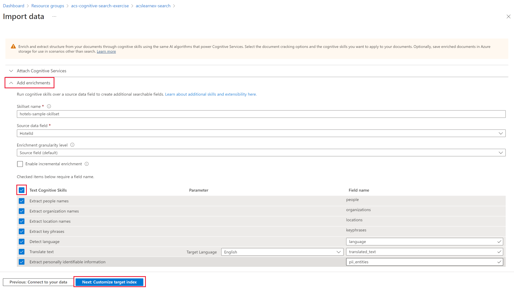
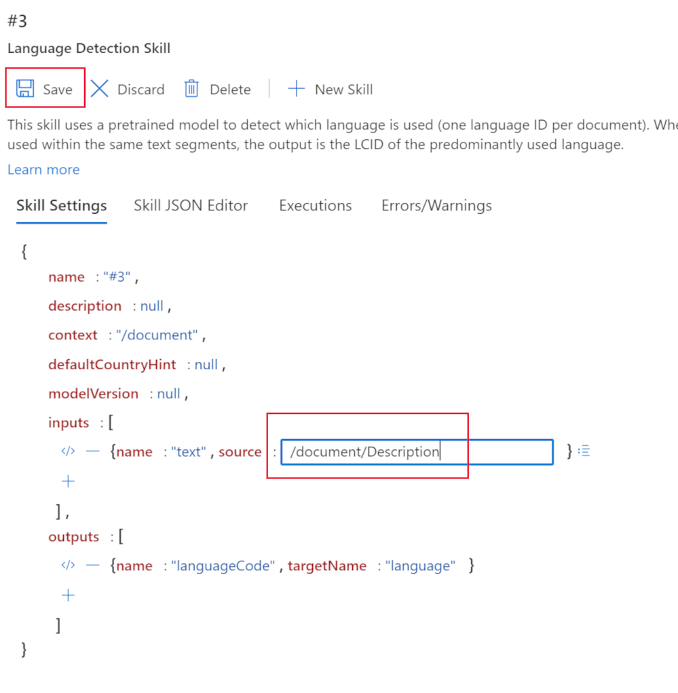
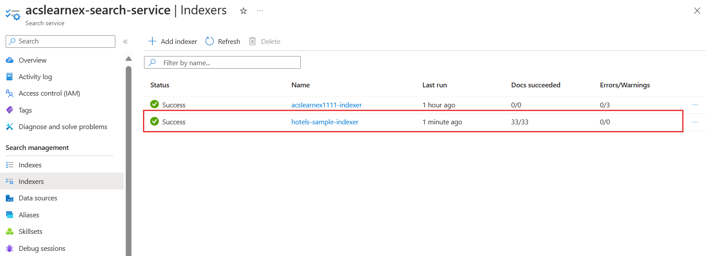

---
lab:
  title: Men-debug masalah pencarian
---

# Men-debug masalah pencarian

Anda telah membangun solusi pencarian Anda tetapi sepertinya terdapat beberapa peringatan pada pengindeks.

Dalam latihan ini, Anda akan membuat solusi Azure AI Search, mengimpor beberapa data sampel, lalu mengatasi peringatan pada pengindeks.

> **Catatan** Untuk menyelesaikan latihan ini, Anda memerlukan langganan Microsoft Azure. Jika Anda belum memilikinya, Anda dapat mendaftar uji coba gratis di [https://azure.com/free](https://azure.com/free?azure-portal=true) .

## Membuat solusi pencarian Anda

Sebelum Anda dapat mulai menggunakan Sesi Debug, Anda perlu membuat layanan Azure Cognitive Search.

1. [Sebarkan sumber daya ke Azure](https://portal.azure.com/#create/Microsoft.Template/uri/https%3A%2F%2Fraw.githubusercontent.com%2FMicrosoftLearning%2Fmslearn-knowledge-mining%2Fmain%2FLabfiles%2F08-debug-search%2Fazuredeploy.json) - pilih tautan ini untuk menyebarkan semua sumber daya yang Anda butuhkan di portal Azure.

    

1. Pada bagian **Grup Sumber Daya**, pilih **Buat baru**.
1. Ketik **acs-cognitive-search-exercise**.
1. Pilih **Wilayah** paling dekat dengan Anda.
1. Untuk **Prefiks Sumber Daya**, masukkan **acslearnex** dan tambahkan kombinasi acak angka atau karakter untuk memastikan nama penyimpanan unik.
1. Untuk Lokasi, pilih wilayah yang sama dengan yang Anda gunakan di atas.
1. Di bagian bawah panel, pilih **Tinjau + buat**.
1. Tunggu hingga sumber daya disebarkan, lalu pilih **Buka grup sumber daya**.

## Mengimpor data sampel

Dengan sumber daya yang telah dibuat, Anda sekarang dapat mengimpor data sumber.

1. Di sumber daya yang tercantum, pilih layanan pencarian.

1. Pada panel **Ringkasan**, pilih **Impor data**.

      

1. Pada panel impor data, untuk Sumber Data, pilih **Sampel**.

      

1. Dalam daftar sampel, pilih **hotels-sample**.
1. Pilih **Berikutnya:Tambahkan keterampilan kognitif (Opsional)**.
1. Luaskan bagian **Tambahkan pengayaan**.

    

1. Pilih **Keterampilan Kognitif Teks**.
1. Pilih **Berikutnya:Sesuaikan indeks target**.
1. Biarkan default, lalu pilih **Berikutnya:Buat pengindeks**.
1. Pilih **kirim**.

## Gunakan sesi debug untuk menyelesaikan peringatan pada pengindeks Anda

Pengindeks sekarang akan mulai menyerap 50 dokumen. Namun, jika Anda memeriksa status pengindeks, Anda akan menemukan bahwa ada peringatan.

1. Pilih **sesi Debug** di panel kiri.

1. Pilih **+ Tambahkan Sesi Debug**.

1. Pilih **Pilih koneksi yang sudah ada** untuk string koneksi Penyimpanan, lalu pilih akun penyimpanan Anda.

    
1. Pilih **+ Kontainer** untuk menambahkan kontainer baru. Beri nama **acs-debug-storage**.

    

1. Atur **Tingkat akses anonim** ke **Kontainer (akses baca anonim untuk kontainer dan blob)**.

    > **Catatan**: Anda mungkin perlu mengaktifkan blob anonim untuk memilih opsi ini. Untuk melakukannya, di akun penyimpanan buka **Konfigurasi** , atur **Izinkan akses anonim Blob** ke **Diaktifkan** lalu pilih **Simpan**.

1. Pilih **Buat**.
1. Pilih kontainer baru Anda dalam daftar, lalu pilih **Pilih**.
1. Pilih **hotel-sample-indexer** untuk **Templat Pengindeks**.
1. Pilih **Simpan Sesi**.

    Grafik dependensi menunjukkan kepada Anda bahwa untuk setiap dokumen ada kesalahan pada tiga keterampilan.
    

1. Pilih **V3**.
1. Pada panel detail keterampilan, pilih **Kesalahan/Peringatan(1)**.
1. Luaskan kolom **Pesan** agar Anda dapat melihat detailnya.

    Detailnya adalah sebagai berikut:

    *Kode bahasa tidak valid '(Tidak Diketahui)'. Bahasa yang didukung: ar,cs,da,de,en,es,fi,fr,hu,it,ja,ko,nl,no,pl,pt-BR,pt-PT,ru,sv,tr,zh-Hans. Untuk detail tambahan, lihat https://aka.ms/language-service/language-support.*

    Jika Anda melihat kembali grafik dependensi, keterampilan deteksi Bahasa memiliki output ke tiga keterampilan dengan peringatan. Selain itu, input keterampilan yang menyebabkan kesalahan adalah `languageCode`.

1. Di grafik dependensi, pilih **Deteksi bahasa**.

    
    Melihat pengaturan keterampilan JSON, perhatikan bidang yang digunakan untuk menyimpulkan bahasa adalah `HotelId`.

    Bidang ini akan menyebabkan kesalahan karena keterampilan tidak dapat menggunakan bahasa berdasarkan ID.

## Menyelesaikan peringatan pada pengindeks

1. Pilih **sumber** di bawah input, dan ubah bidang menjadi `/document/Description`.
    
1. Pilih **Simpan**.
1. Pilih **Jalankan**.

    

    Pengindeks seharusnya tidak lagi memiliki kesalahan atau peringatan. Kumpulan keterampilan sekarang dapat diperbarui.

1. Pilih **Terapkan perubahan...**

    
1. Pilih **OK**.

1. Sekarang Anda perlu memastikan bahwa set keterampilan Anda dilampirkan ke sumber daya Layanan Azure AI, jika tidak, Anda akan mencapai kuotasi dasar dan pengindeks akan habis. Untuk melakukannya, pilih **Set Keterampilan** di panel kiri, lalu pilih **hotels-sample-skillset** Anda.

    
1. Pilih **Sambungkan Layanan AI**, lalu pilih sumber daya layanan AI di dalam daftar.

    
1. Pilih **Simpan**.

1. Sekarang jalankan pengindeks Anda untuk memperbarui dokumen dengan pengayaan AI tetap. Untuk melakukan ini, pilih **Pengindeks** di panel kiri, pilih **hotels-sample-indexer**, lalu pilih **Jalankan**.  Setelah selesai berjalan, Anda akan melihat bahwa peringatan sekarang nol.

    

### Pembersihan

 Sekarang Anda telah menyelesaikan latihan, jika Anda telah selesai menjelajahi layanan Pencarian Azure AI, hapus sumber daya Azure yang Anda buat selama latihan. Cara termudah untuk melakukannya adalah menghapus grup sumber daya **acs-cognitive-search-exercise**.
