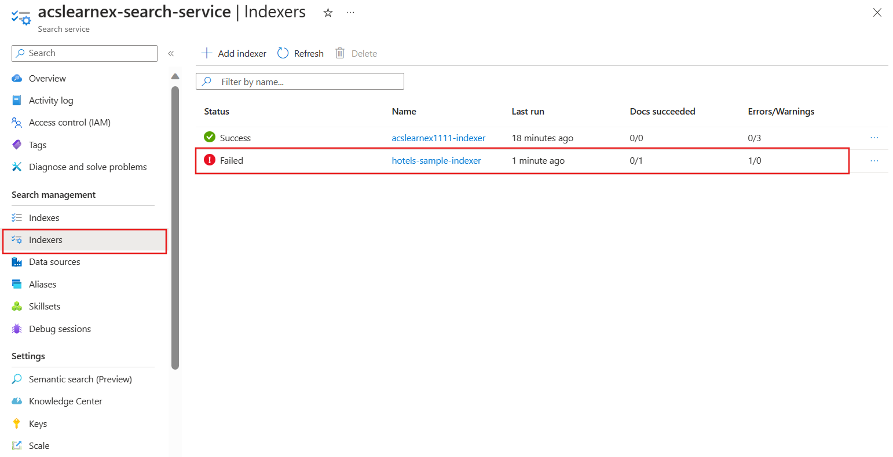
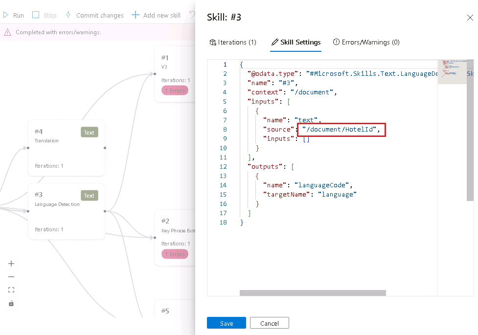

---
lab:
  title: Men-debug masalah pencarian
---

# Men-debug masalah pencarian

Anda telah membangun solusi pencarian Anda tetapi sepertinya terdapat beberapa peringatan pada pengindeks.

Dalam latihan ini, Anda akan membuat solusi Azure AI Search, mengimpor beberapa data sampel, lalu mengatasi peringatan pada pengindeks.

> **Catatan** Untuk menyelesaikan latihan ini, Anda memerlukan langganan Microsoft Azure. Jika Anda belum memilikinya, Anda dapat mendaftar uji coba gratis di [https://azure.com/free](https://azure.com/free?azure-portal=true) .

## Membuat solusi pencarian Anda

Sebelum Anda dapat mulai menggunakan Sesi Debug, Anda perlu membuat layanan Pencarian Azure AI.

1. [Menyebarkan sumber daya ke Azure](https://portal.azure.com/#create/Microsoft.Template/uri/https%3A%2F%2Fraw.githubusercontent.com%2FMicrosoftLearning%2Fmslearn-knowledge-mining%2Fmain%2FLabfiles%2F08-debug-search%2Fazuredeploy.json) - jika Anda sedang menggunakan VM yang dihosting, salin tautan ini dan tempelkan ke browser VM. Jika tidak, pilih tautan ini untuk menyebarkan semua sumber daya yang Anda butuhkan di portal Azure.

    

1. Di bawah **Grup Sumber Daya**, pilih grup sumber daya yang telah disediakan atau pilih **Buat baru** dan ketik **debug-search-exercise**.
1. Pilih **Wilayah** terdekat dengan Anda, atau gunakan default.
1. Untuk **Prefiks Sumber Daya**, masukkan **debugsearch** dan tambahkan kombinasi acak angka atau karakter untuk memastikan nama penyimpanan unik.
1. Untuk Lokasi, pilih wilayah yang sama dengan yang Anda gunakan di atas.
1. Di bagian bawah panel, pilih **Tinjau + buat**.
1. Tunggu hingga sumber daya disebarkan, lalu pilih **Buka grup sumber daya**.

## Mengimpor data sampel dan mengonfigurasi sumber daya

Dengan sumber daya yang telah dibuat, Anda sekarang dapat mengimpor data sumber.

1. Pada sumber daya yang tertera, arahkan ke akun penyimpanan. Buka **Konfigurasi** di panel kiri, atur **Izinkan akses anonim Blob** ke **Diaktifkan** lalu pilih **Simpan**.
1. Arahkan kembali ke grup sumber daya Anda, dan pilih layanan pencarian.
1. Pada panel **Ringkasan**, pilih **Impor data**.

      

1. Pada panel impor data, untuk Sumber Data, pilih **Sampel**.

      

1. Dalam daftar sampel, pilih **hotels-sample**.
1. Pilih **Berikutnya:Tambahkan keterampilan kognitif (Opsional)**.
1. Luaskan bagian **Tambahkan pengayaan**.

    

1. Pilih **Keterampilan Kognitif Teks**.
1. Pilih **Berikutnya:Sesuaikan indeks target**.
1. Biarkan default, lalu pilih **Berikutnya:Buat pengindeks**.
1. Pilih **kirim**.

## Gunakan sesi debug untuk menyelesaikan peringatan pada pengindeks Anda

Pengindeks sekarang akan mulai menyerap 50 dokumen. Namun, jika Anda memeriksa status pengindeks, Anda akan menemukan bahwa ada peringatan.

1. Pilih **sesi Debug** di panel kiri.
1. Pilih **+ Tambahkan Sesi Debug**.
1. Berikan nama untuk sesi tersebut, dan pilih **hotel-sample-indexer** untuk **Templat Pengindeks**.
1. Pilih akun penyimpanan Anda dari kolom **Akun penyimpanan**. Ini akan secara otomatis membuat kontainer penyimpanan bagi Anda untuk menyimpan data debug.
1. Biarkan kotak centang untuk mengautentikasi menggunakan identitas terkelola tidak tercentang.
1. Pilih **Simpan**.
1. Setelah dibuat, sesi debug akan secara otomatis berjalan pada data di layanan pencarian Anda. Ini seharusnya selesai dengan kesalahan/peringatan.

    Grafik dependensi menunjukkan kepada Anda bahwa untuk setiap dokumen ada kesalahan pada tiga keterampilan.
    

    > **Catatan**: Anda mungkin melihat kesalahan tentang menyambungkan ke akun penyimpanan dan mengonfigurasi identitas terkelola. Ini terjadi jika Anda mencoba men-debug terlalu cepat setelah mengaktifkan akses blob anonim, dan menjalankan sesi debug seharusnya masih berfungsi. Merefresh jendela browser setelah beberapa menit seharusnya akan menghapus peringatan.

1. Dalam grafik dependensi, pilih salah satu node keterampilan yang memiliki kesalahan.
1. Pada panel detail keterampilan, pilih **Kesalahan/Peringatan(1)**.

    Detailnya adalah sebagai berikut:

    *Kode bahasa tidak valid '(Tidak Diketahui)'. Bahasa yang didukung: af,am,ar,as,az,bg,bn,bs,ca,cs,cy,da,de,el,en,es,et,eu,fa,fi,fr,ga,gl,gu,he,hi,hr,hu,hy,id,it,ja,ka,kk,km,kn,ko,ku,ky,lo,lt,lv,mg,mk,ml,mn,mr,ms,my,ne,nl,no,or,pa, pl,ps,pt-BR,pt-PT,ro,ru,sk,sl,so,sq,sr,ss,sv,sw,ta,te,th,tr,ug,uk,your,uz,vi,zh-Hans,zh-Hant. Untuk detail tambahan, lihat https://aka.ms/language-service/language-support.*

    Jika Anda melihat kembali grafik dependensi, keterampilan Deteksi Bahasa memiliki output ke ketiga keterampilan dengan peringatan. Jika Anda melihat pengaturan keterampilan dengan kesalahan, Anda akan melihat input keterampilan yang menyebabkan kesalahan adalah `languageCode`.

1. Di grafik dependensi, pilih **Deteksi bahasa**.

    
    Melihat pengaturan keterampilan JSON, perhatikan bidang yang digunakan untuk menyimpulkan bahasa adalah `HotelId`.

    Bidang ini akan menyebabkan kesalahan karena keterampilan tidak dapat menggunakan bahasa berdasarkan ID.

## Menyelesaikan peringatan pada pengindeks

1. Pilih **sumber** di bawah input, dan ubah bidang menjadi `/document/Description`.
1. Pilih **Simpan**.
1. Pilih **Jalankan**. Pengindeks seharusnya tidak lagi memiliki kesalahan atau peringatan. Kumpulan keterampilan sekarang dapat diperbarui.

    
   
1. Pilih **Terapkan perubahan** untuk mendorong perubahan yang dibuat dalam sesi ini ke pengindeks Anda.
1. Pilih **OK**. Sekarang Anda dapat menghapus sesi Anda.

Sekarang Anda perlu memastikan bahwa set keterampilan Anda dilampirkan ke sumber daya Layanan Azure AI, jika tidak, Anda akan mencapai kuota dasar dan pengindeks akan habis waktunya. 

1. Untuk melakukannya, pilih **Set Keterampilan** di panel kiri, lalu pilih **hotels-sample-skillset** Anda.

    
1. Pilih **Sambungkan Layanan AI**, lalu pilih sumber daya layanan AI di dalam daftar.

    
1. Pilih **Simpan**.

1. Sekarang jalankan pengindeks Anda untuk memperbarui dokumen dengan pengayaan AI tetap. Untuk melakukan ini, pilih **Pengindeks** di panel kiri, pilih **hotels-sample-indexer**, lalu pilih **Jalankan**.  Setelah selesai berjalan, Anda akan melihat bahwa peringatan sekarang nol.

    

## Pembersihan

 Sekarang Anda telah menyelesaikan latihan, jika Anda telah selesai menjelajahi layanan Pencarian Azure AI, hapus sumber daya Azure yang Anda buat selama latihan. Cara termudah untuk melakukannya adalah menghapus grup sumber daya **debug-search-exercise**.
