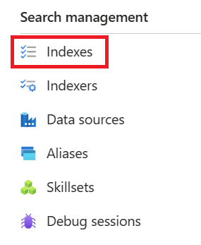

---
lab:
  title: Menyiapkan pemeringkat semantik
---

# Menyiapkan pemeringkat semantik

> **Catatan** Untuk menyelesaikan lab ini, Anda memerlukan [langganan Azure](https://azure.microsoft.com/free?azure-portal=true) dengan akses administrator. Latihan ini juga memerlukan layanan **Pencarian Azure AI** dengan tingkat yang dapat ditagih.

Dalam latihan ini, Anda akan menambahkan pemeringkat semantik ke indeks dan menggunakan pemeringkat semantik untuk kueri.

## Aktifkan pemeringkat semantik

1. Buka portal Azure dan masuk.
1. Pilih **Semua sumber daya** dan pilih layanan pencarian Anda.
1. Di panel navigasi, pilih **Pemeringkat semantik (pratinjau)**.
1. Di **Ketersediaan**, dalam opsi **Gratis**, pilih **Pilih Paket**.


## Mengimpor indeks sampel

1. Kembali ke halaman **Gambaran Umum** layanan pencarian Anda.
1. Pilih **Impor data**.

    

1. Data **Sumber Data**, pilih **Sampel**.
1. Pilih **hotels-sample** dan pilih **Berikutnya: Tambahkan keterampilan kognitif (Opsional)**.
1. Pilih **Lewati ke: Sesuaikan indeks target**.
1. Pilih **Berikutnya: Membuat pengindeks**.
1. Pilih **kirim**.

## Konfigurasikan peringkat semantik

Setelah Anda mengaktifkan indeks pencarian dan peringkat semantik, Anda dapat mengonfigurasi peringkat semantik. Anda memerlukan klien pencarian yang mendukung API pratinjau pada permintaan kueri. Anda dapat menggunakan Penjelajah pencarian di portal Microsoft Azure, aplikasi Postman, Azure SDK untuk .NET, atau Azure SDK untuk Python. Dalam latihan ini, Anda akan menggunakan penjelajah Pencarian di portal Microsoft Azure.

Untuk mengonfigurasi peringkat semantik, ikuti langkah-langkah berikut:

1. Pada bilah navigasi, di **Manajemen pencarian**, pilih **Indeks**.

    

1. Pilih indeks Anda.
1. Pilih **Konfigurasi semantik ** dan pilih **Tambahkan konfigurasi semantik**.
1. Dalam **Nama** ketik **hotels-conf**.
1. Di **Bidang judul ** pilih **HotelName**.
1. Di bawah **Bidang konten**, di **Nama bidang**, pilih **Deskripsi**.
1. Ulangi langkah sebelumnya untuk bidang berikut:
    - **Golongan**
    - **Alamat/Kota**
1. Di bawah**Bidang kata kunci **, di **Nama bidang**, pilih **Tag**.
1. Pilih **Simpan**.
1. Pada halaman indeks Anda, pilih **Simpan**.
1. Pilih **Penjelajah pencarian**.
1. Pilih **Tampilkan** dan pilih **Tampilan JSON**.
1. Di editor kueri JSON ketik teks berikut:

    ```json
        {
         "queryType": "semantic",
         "queryLanguage" : "en-us",
         "search": "all hotels near the water" , 
         "semanticConfiguration": "hotels-conf" , 
         "searchFields": "",
         "speller": "lexicon" , 
         "answers": "extractive|count-3",
         "count": true
        }
    ```

1. Pilih **Telusuri**.
1. Tinjauan hasil kueri.

## Pembersihan

Jika Anda tidak lagi memerlukan layanan Pencarian Azure AI, Anda harus menghapus sumber daya dari langganan Azure Anda untuk mengurangi biaya.

>**Catatan** Menghapus layanan Pencarian Azure AI memastikan langganan Anda tidak akan dikenakan biaya untuk sumber daya. Namun, Anda akan dikenakan biaya kecil untuk penyimpanan data selama penyimpanan ada di langganan Anda. Jika Anda telah selesai menjelajahi layanan Cognitive Search, Anda dapat menghapus layanan Cognitive Search dan sumber daya terkait. Namun, jika berencana untuk menyelesaikan laboratorium lain dalam seri ini, Anda harus membuatnya kembali.
> Untuk menghapus sumber daya Anda:
> 1. Di [Portal Microsoft Azure](https://portal.azure.com?azure-portal=true ), di halaman **Grup sumber daya**, buka grup sumber daya yang Anda tentukan saat membuat layanan Cognitive Search Anda.
> 1. Klik **Hapus grup sumber daya**, ketik nama grup sumber daya untuk mengonfirmasi bahwa Anda ingin menghapusnya, dan pilih **Hapus**.
