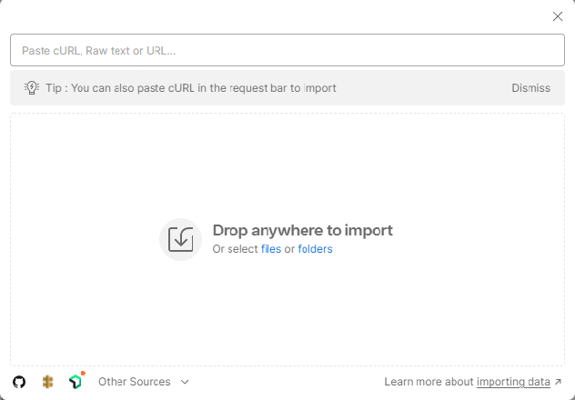

---
lab:
  title: Menggunakan REST API untuk menjalankan kueri pencarian vektor
---

# Menggunakan REST API untuk menjalankan kueri pencarian vektor

Dalam latihan ini Anda akan menyiapkan proyek, membuat indeks, mengunggah dokumen, dan menjalankan kueri.

Anda akan memerlukan hal berikut agar dapat berhasil dalam latihan ini:

- [Aplikasi Postman](https://www.postman.com/downloads/)
- Langganan Azure
- Layanan Pencarian Azure AI
- Koleksi sampel Postman yang berada di repositori ini - *Vector-Search-Quickstart.postman_collection v1.0 json*.

> **Catatan** Anda dapat menemukan informasi selengkapnya tentang aplikasi Postman [di sini](https://learn.microsoft.com/en-us/azure/search/search-get-started-rest) jika diperlukan.

## Menyiapkan proyek Anda

Pertama-tama siapkan proyek Anda dengan melakukan langkah-langkah berikut:

1. Catat **URL** dan **Kunci** dari layanan Pencarian Azure AI Anda.

    

1. Unduh [koleksi sampel Postman](https://github.com/MicrosoftLearning/mslearn-knowledge-mining/blob/main/Labfiles/10-vector-search/Vector%20Search.postman_collection%20v1.0.json).
1. Buka Postman dan impor koleksi dengan memilih tombol **Impor** lalu seret dan lepaskan folder koleksi ke dalam kotak.

    

1. Pilih tombol **Fork** untuk membuat fork koleksi dan menambahkan nama unik.
1. Klik kanan nama koleksi Anda dan pilih **Edit**.
1. Pilih tab **Variabel** dan masukkan nilai berikut menggunakan layanan pencarian dan nama indeks dari layanan Pencarian Azure AI Anda:

    

1. Simpan perubahan dengan memilih tombol **Simpan**.

Anda siap mengirim permintaan ke layanan Pencarian Azure AI.

## Membuat Indeks

Selanjutnya, buat indeks Anda di Postman:

1. Pilih **PUT Buat/Perbarui Index** dari menu samping.
1. Perbarui URL dengan **nama-layanan-pencarian**, **nama-indeks**, dan **versi-api** yang Anda catat sebelumnya.
1. Pilih tab **Isi** untuk melihat respons.
1. Atur **nama-indeks** dengan nilai nama indeks dari URL Anda dan pilih **Kirim**.

Anda akan melihat kode status dengan tipe **200** yang menunjukkan permintaan berhasil.

## Mengunggah Dokumen

Ada 108 dokumen yang disertakan dalam permintaan Unggah Dokumen, masing-masing memiliki serangkaian penyematan lengkap untuk bidang **titleVector** dan **contentVector**.

1. Pilih **POST Unggah Dok** dari menu samping.
1. Perbarui URL dengan **nama-layanan-pencarian**, **nama-indeks**, dan **versi-api** seperti sebelumnya.
1. Pilih tab **Isi** untuk melihat respons dan pilih **Kirim**.

Anda akan melihat kode status dengan tipe **200** untuk menunjukkan bahwa permintaan Anda berhasil.

## Menjalankan Kueri

1. Sekarang coba jalankan kueri berikut di menu samping. Untuk melakukannya, pastikan untuk memperbarui URL setiap kali seperti sebelumnya dan kirim permintaan dengan memilih **Kirim**:

    - Pencarian Vektor tunggal
    - Pencarian Vektor tunggal dengan Filter
    - Pencarian hibrid sederhana
    - Pencarian hibrid sederhana dengan Filter
    - Pencarian lintas bidang
    - Pencarian multi-kueri

1. Pilih tab **Isi** untuk melihat respons dan menampilkan hasilnya.

Anda akan melihat kode status dengan tipe **200** untuk permintaan berhasil.

### Pembersihan

Sekarang setelah Anda menyelesaikan latihan, hapus semua sumber daya yang tidak lagi Anda perlukan. Mulailah dengan kode yang dikloning ke mesin Anda. Kemudian hapus sumber daya Azure.
